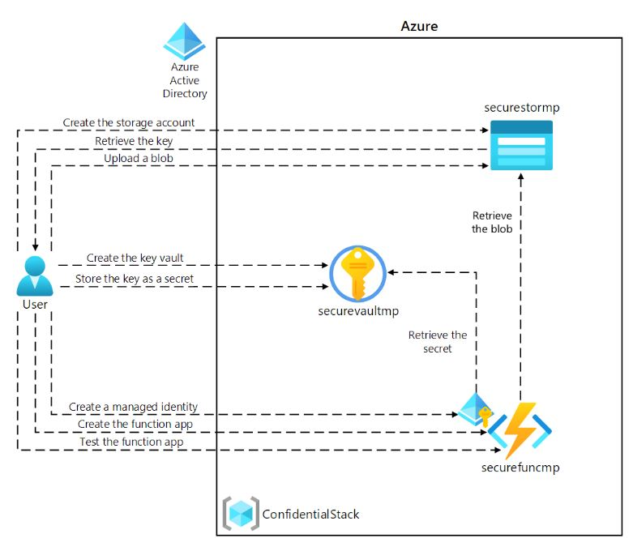

# Lab 07: Access resource secrets more securely across services



## Excercise 1 : Create Azure resources
1. Storage Accounts 생성 - Access key (key, Conncetion string 저장)
2. Key vaults 생성
3. Function App 생성 - Storage 탭에서 Storage Account 연결


## Excercise 2 : Configure secrets and identities
- Resources Group (명칭 : ConfidentialStack-{randomcode}) 클릭
  1. Function App (securefunchayoung)
    - Settings > Identity > Status On
  2. Key Vault Secrets (securevaulthayoung)
    - Objects > Secrets
    - Generate secret : Connection String(Storage account connection string)
    - storagecredentials > Copy 1. Secret Identifier, 2. Secret Value
  3. Key Vault Secrets (securevaulthayoung)
    - Create policy
      - Overview > Access policies
        1. Permissions : check Get
        2. Principal : securefunchayoung
  4. Function App (securefunchayoung)
    - Settings > Environment variables > App settings > + Add
      - StorageConnectionString : Secret Identifier (ex: https://securevaulthayoung2.vault.azure.net/secrets/storagecredentials/958e2f9ea4114784a6081c053b59d8b7)
    - Apply

## Excercise 3 : Build an Azure Functions app
- VsCode
  1. local.settings.json
    ```
    "Values": {
          "AzureWebJobsStorage": "UseDevelopmentStorage=true",
          "FUNCTIONS_WORKER_RUNTIME": "dotnet-isolated",
          "StorageConnectionString": "DefaultEndpointsProtocol={}"
    }
    ```
  2. FileParser.cs 수정
  3. func start --build
  4. az login
  5. func azure functionapp publish <function-app-name> --dotnet-version 8.0
- Portal
  1. Resource groups > ConfidentialStack-{} > securefunchayoung
  2. Function App > Functions > FileParser
  3. Test/Run > 'Get' > Run


## Exercise 4: Access Azure Blob Storage data
- Resource Group > securestorhayoung > Data Storage > Containers > blob file 업로드