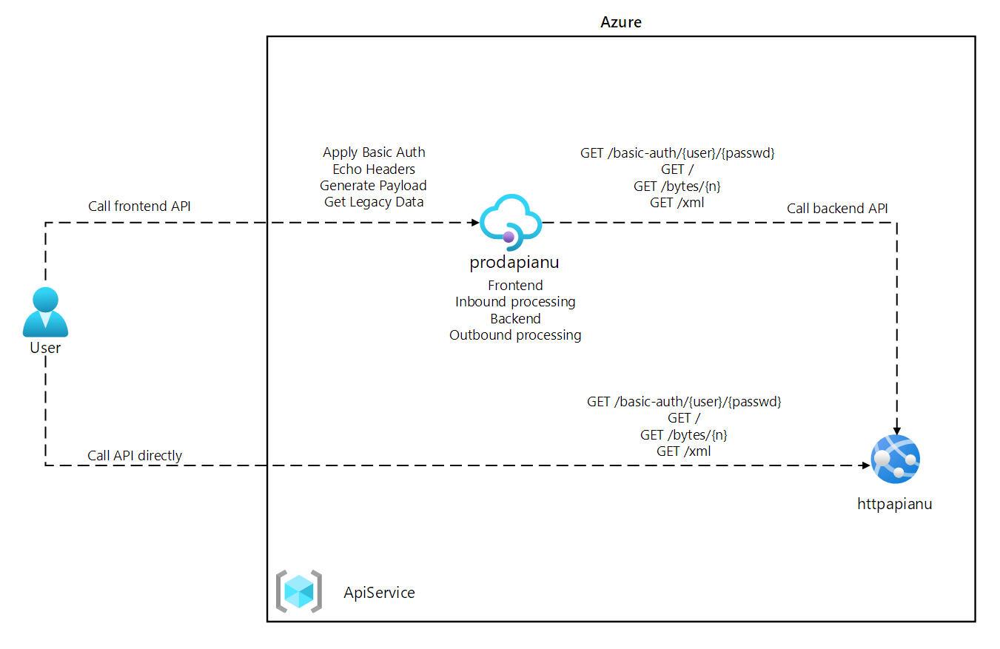

# Lab 08: Create a multi-tier solution by using Azure services



## API Management service
- policies > Backend : https://httpapi[yourname].azurewebsites.net/headers
  - Echo
    ```
    https://httpapihayoung-f2dpcverewh7e7ds.eastus2-01.azurewebsites.net/headers
    ```
  - GET
    ```
    https://httpapihayoung-f2dpcverewh7e7ds.eastus2-01.azurewebsites.net
    ```
  - Modify Status
    ```
    https://httpapihayoung-f2dpcverewh7e7ds.eastus2-01.azurewebsites.net
    ```